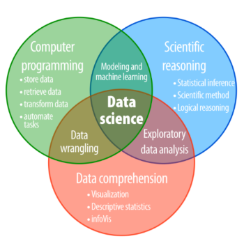

```{r setup, include=FALSE}
knitr::opts_chunk$set(echo = FALSE,
                      messsage = FALSE,
                      warning = FALSE,
                      fig.height = 5,
                      dpi = 60
                      )
```


## What this course will teach you?

.pull-left[

- Getting started

    - Installing the required softwares
    
    - Setting up your R workspace
    
- Part I

    - Why use R?
    
    - Overview of data science/data analytics
    
    - Using R and RStudio

]

.pull-right[

- Part II

    - Importing your data

    - Data cleaning and transformation
    
    - Basic data analysis
    
    - Plotting charts
    
- Part III

    - Communicating your results
    
    - Summary
    
    - Next steps
]

---


## Who is this class for?

.left-column[

- New R users

- No prior computer programming knowledge 

- No assumed prior knowledge of statistics

]

.right-column[

```{r, assumptions}
knitr::include_graphics("./imgs/assumptions.png")
```
]

---
class: inverse, middle, center
background-image: url(imgs/poster.jpeg)
background-size: contain

# Meet the facilitators!


---

## Setting up your workspace 

.pull-left[

- Modify default settings

- From the __*Tools*__ tab, go to __*Global Options...*__ (the last listed item)

- Confirm that the places highlighted are unchecked

```{r, workspace}
knitr::include_graphics("./imgs/workspace_1.png")
```
]

.pull-right[

```{r, workspace-1}
knitr::include_graphics("./imgs/workspace2.png")
```
]

---


## Setting up your workspace - Project

.pull-left[

- Use R projects

- Makes your work easy to share with others

- Identified by a "__*.Rproj*__" file in the folder

- Create R project

    - Click on the __*File*__ tab, then

    - Click on __*New project*__ (should be the second option from the listed items)

    - Create from "New" or "Existing" folders

]

.pull-right[

```{r, project}

```

]

---


## Navigating RStudio 

.left-column[

- 3 - 4 window panes

- Use the Editor pane for your codes

- Send codes from the __*editor*__ to the __*console*__ either using the __*run*__ tab (it has a drop-down) or use "Ctrl + Enter"

]

.right-column[

```{r, rstudio-pane}
knitr::include_graphics("./imgs/rstudio pane.png")
```
]


---


## Data Science - Overview

.left-column[
- A combination of 

    - computer programming
    
    - Scientific reasoning 
    
    - Data comprehension
    
- Varying mix of the above, depending on the specialization

]

.pull-right[
```{r, datascience}

```
]

---


## Data Science - Workflow

.left-column[

- Getting your data (Excel, csv, etc) into R

- Formatting your data appropriately

- Identifying patterns (exploration)

- Plotting graphs

- Performing statistics

- Passing the information

]

.pull-right[
```{r, datascience-workflow}

```
]


---

## Tabular data

.left-column[

- Rows are horizontal

- Columns are vertical

- Should be __*tidy*__

    - Each variable must have its own column
    
    - Each observation must have its own row
    
    - Each value must have its own cell
]

.right-column[
```{r, tidy}
knitr::include_graphics("./imgs/tidy data.png")
```

  > "Tidy datasets are alike, but every messy dataset is messy in its own way"
  >
  > - Hadley Wickham
]

---

## Tidy data

.pull-left[

What makes this data *"untidy"*?
```{r, untidy-data}

```
]

.pull-right[
What makes this data "*tidy"*?

```{r, tidy-data}
knitr::include_graphics("./imgs/tidy.png")
```
]

---

## Variables

- Numeric variables

    - Continuous (can be expressed as fractions) e.g. weight
    
    - Discrete (always whole numbers) e.g. heart rate

- Categorical variables (generally coded)

    - ordinal (a graduation pattern observable) e.g. level of education
    
    - nominal (no ranking) e.g. gender/sex
    
- Text variables e.g. Name

- __*Type of analysis depends on the variable type*__

- __*Variables can be converted from one form to another*__ e.g. age (a numeric variable), can be binned into age-groups (a categorical variable)

---

## R functions

- Essentially the "heart" of R

- R can perform simple arithmetics like `1 + 1`

- Most functions follow this format:


    function_name(object, 1st argument, 2nd argument, etc)

    
- Example, assuming you have a population of 10 and you want to sample 2 persons (without replacement)


    sample(x = 1:10, size = 2, replace = FALSE)

- You can have functions with no arguments e.g. `Sys.Date()`

- You can also have functions without name (so called anonymous functions)

---

## R packages

.pull-left[

- All R functions are contained in *packages*

- *R packages* are a collection of *functions* that perform similar tasks

- R comes with pre-installed packages 

- Packages extend the functions of base R

- Additional packages can be installed depending on your needs

- *CRAN* and *GitHub* are two common package repositories

- You can also write your own packages!!!

]

.pull-right[
- to install a package from CRAN, use:

    `install.packages("pkg_name")`

- better still, use the `p_install()` function from the {pacman} package:

    p_install("pkg_name")
    
- Load packages (except for base R packages)

- To load a package, use:

  `library("pkg_name")` or
  
  `p_load("pkg_name")` # the `p_load()` function is from the {pacman} package so yu will have to load {pacman} first
  
]

---


## Assigning values

.pull-left[

- R can let you "save" a value for re-use

- To save a value, decide on the name you want to give it

- Use syntactic names

  - A combination of letters, digits, ".", and "_"

  - Don't start with a number
  
  - When you start with a ".", it cannot be followed by a number 
  
  - no spaces allowed
  
  - avoid *reserved* words
  
]

.pull-right[

- Use meaningful names (for your sake and others)

- Generally two common naming conventions (snakecase & camelcase):

  - Here is a snakecase example: this_is_a_snake_case
  
  - Here is a camelcase example: thisIsACamelCase
  
- I recommend the snakecase

- Caution!! Existing values of a similar name will be overwritten so names have to be unique

]
  
---

## Vectors: data building blocks

.pull-left[

- How R recognise variable/data type

- Atomic vectors (4 common)

  1. integers (equivalent of discrete variables) e.g. `c(20L, 4L, 100L)`
  
  2. double (equivalent of continuous variables) e.g. `c(20, 4, 100)`
  
      are approximations (is 2 equals to squaroot of 2 exponential 2?)
  
  3. logical/boolean
  
  4. characters e.g. `c("Stephen", "12", "TRUE")`
  
  5. complex
  
  6. raw
]

.pull-right[

#### Hierarchy of vectors

```{r, vectors}

```

*try*: c(20, TRUE, "Stephen")
]

---

## Vectors: lists & augmented vectors

.pull-left[

How about dates & categorical variables?

- 4 Augmented vectors

  1. factors (from integers)
  
  2. date (from double) 
  
    R format for date is the ISO8601 (yyyy-mm-dd)
  
  3. datetime (from double)
  
  4. duration i.e. time difference (from double)

]

.pull-right[

What if I want to have a mix of data types?

- Lists

    e.g. `list(29, TRUE, "Stephen")`

- Dataframes

    - data with rows and columns
    
    - variables are in the columns, observations in the rows (tidy data)
    
    - columns must be of equal length
    
    - each column can have only one type of vector

]


---

## Working with vectors

.pull-left[

What type of vector am I dealing with?

- use `typeof()` e.g.

    `typeof(10)`
    
    `typeof("Stephen")`
    
    `typeof(TRUE)`
    
    `typeof("FALSE")` [practice]

]

.pull-right[
    
Can I check to know if my vector is of a particular type?

- use `is.atomic_type` e.g.

    `is.double(10)`
    
    `is.logical(TRUE)`

Can I force my vectors to change from one type to another? yes

- use `as.atomic_type` e.g.

    `as.integer("10")`
  
    `as.logical("FALSE")`

]

---

## Arithmetic operators

.pull-left[

- addition sign (+)

- substraction sign (-)

- division sign (/)

- multiplication sign (*)

- Exponential sign (^)

- integer division (%/%)

- modulo division (%%) - remainder

- greater than (>) e.g. 5 > 3

- less than (<) e.g. 5 < 3

]

.pull-right[

- greater than or equal to (>=) e.g. `5 >= 10/2`

- less than or equal to (<=) e.g. `5 <= 10/2`

- equal to (==) e.g. `1/49 * 49 == 1`

- not equal to (!=) e.g. `4 != 2*2`

- not/negate (!) e.g. `!TRUE`

- or (|) e.g. `4 > 6 | 3`

- and (&) e.g. `4 > 6 & 3`

- contains (%in%) e.g. `c("Stephen", "Taiye", "Kehinde", "Tade", "Tola") %in% c("Taiye", "Kehinde")`
]

---

## Summary

1. Set up your working environment, use R project.

2. Data is not always tidy. You may need to manipulate the data to get it in the right format.

3. Most interactions with R will be via functions. Functions are organized into packages.

4. If you want to keep objects in memory, you must assign them to a name.

5. Most arithmetic operators are similar to what you would expect.

---
class: inverse, middle, center
background-image: url(https://upload.wikimedia.org/wikipedia/commons/3/39/Naruto_Shiki_Fujin.svg)
background-size: contain

# Questions


