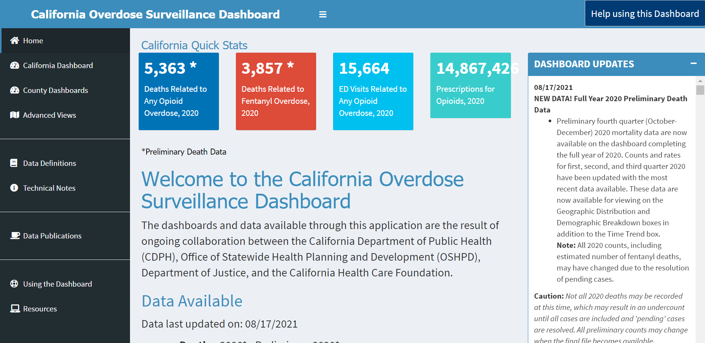
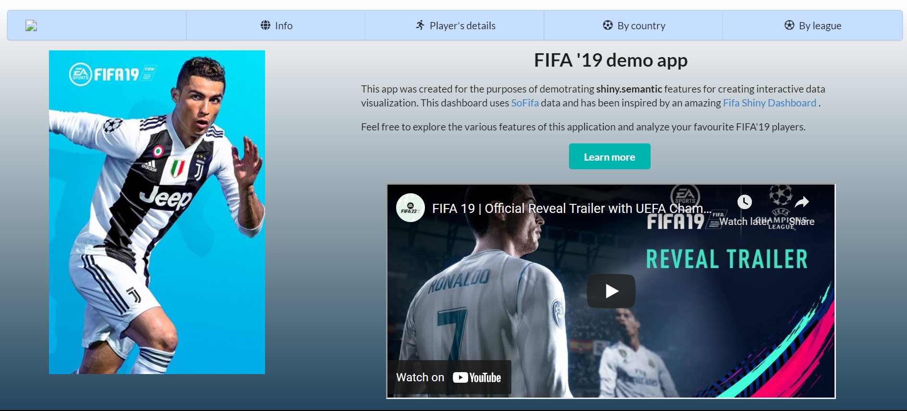
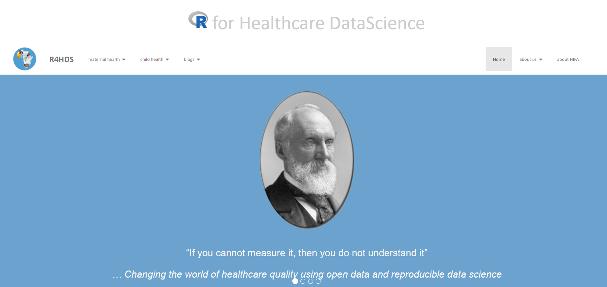
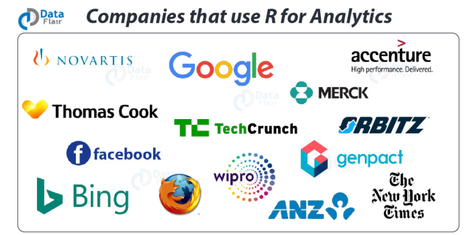
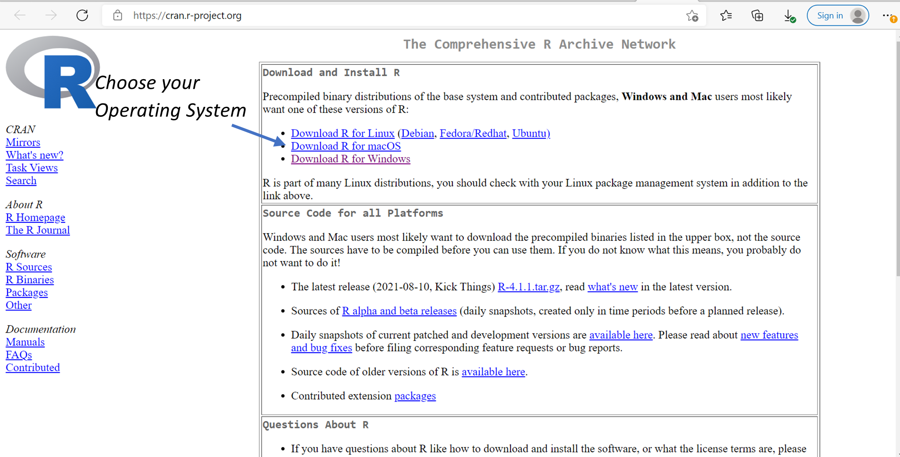
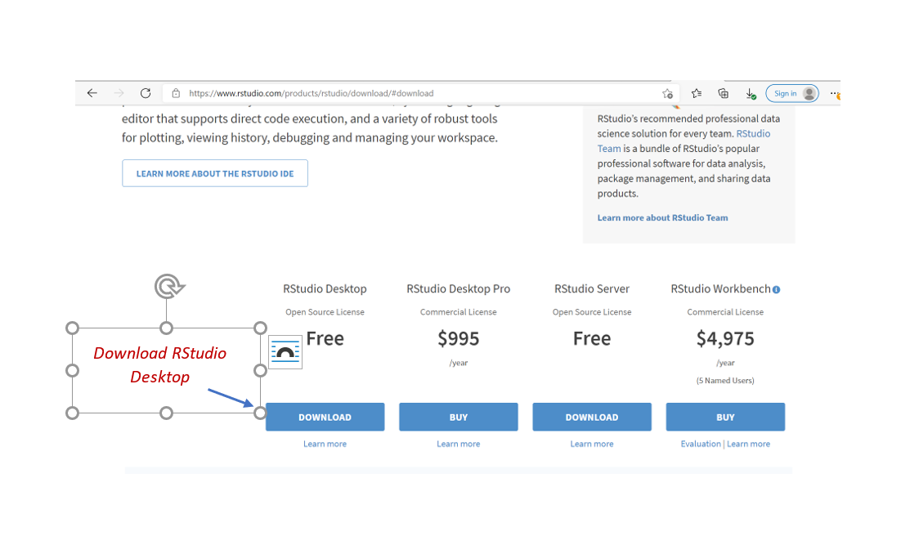

```{r setup, include=FALSE}
knitr::opts_chunk$set(echo = FALSE,
                      messsage = FALSE,
                      warning = FALSE,
                      fig.height = 5,
                      dpi = 60
                      )
```

class: inverse, center, hide-logo, title
background-image: url(imgs/title.png)
background-size: cover

## <span style='font-family:Arial; color: black; font-weight:400;'>Right Start Programming with R language</span>

### Part I: Getting started

.left[

<span style="font-weight: 600; font-size: 28px;">Stephen Balogun</span>

<span style="font-weight: 600; font-size: 28px;">Bilikisu Aderinto</span>

<span class="my_date">`r format(as.Date("2022-01-29"), "%a, %B %d %Y")`</span>

]

---

## Stephen Balogun

.left-column[
```{r, stephen}
knitr::include_graphics("./imgs/Stephen.png")
```
]

.right-column[

- A Public Health Physician

- A healthcare improvement safety expert - led me to data science

- Disease surveillance expert and epidemiologist

- Author, [{tidyndr}](https://CRAN.R-project.org/package=tidyndr)

- Co-founder: [r4hds](https://r4hds.netlify.app/)

- Co-organizer: [Abuja R user Group](https://www.meetup.com/Abuja-R-User-Group-Meetup/)

- `r fontawesome::fa("globe")`: [stephenbalogun.github.io/stbalogun](https://stephenbalogun.github.io/stbalogun/) `r emoji::emoji("smile")`

- `r fontawesome::fa("twitter")`: [@eppydoc]((https://twitter.com/eppydoc) `r emoji::emoji("thumbsup")`

- `r fontawesome::fa("linkedin")`: [Stephen Balogun](https://www.linkedin.com/in/stbalogun/) 
]

---

## Bilikisu Aderinto

.f3[
&#x1F44B; Hi, I'm **Bilikisu Wunmi Aderinto**
]

--

.f3[
&#x1F426; [&commat;qbwoa](https://twitter.com/qbwoa)
]

--

.f3[
&#x1F9D1;&#x200D;&#x1F4BB; [baderinto.github.io](https://baderinto.github.io)
]

--

`r fontawesome::fa("linkedin")` .f3[ [Bilikisu Wunmi Aderinto](https://www.linkedin.com/in/bilikisuaderinto/)]

--

.f3[
&#x1F4BC; [Business Data Laboratory](https://business-datalab.com): **Principal Consultant/freelancer**
]

--
.f3[&#x1F469;[Abuja R user Group](https://www.meetup.com/Abuja-R-User-Group-Meetup/): **Founder, Co-organizer** 
]

--
.f3[&#x1F469;[R-Ladies Abuja](https://https://www.meetup.com/rladies-abuja/): **Co-founder, Organizer** 
]

---

class: top, center, hide-logo, abuja
background-image: url(imgs/LOGO.jfif)

# About Abuja R user Group


---

## What this course will teach you?

.pull-left[

    
- Part I: Getting started

    - Workshop assumptions
    
    - Why use R?
    
    - Overview of data science/data analytics
    
    - Tabular data and its building blocks
    
    - Installing the required softwares
    
    - Setting up your R workspace
    
    - Using R and RStudio

]

.pull-right[

- Part II

    - Importing your data

    - Data cleaning and transformation
    
    - Basic data analysis
    
    - Plotting charts
    
- Part III

    - Communicating your results
    
    - Summary
    
    - Next steps
]

---


## Who is this class for?

.left-column[

- New R users

- No prior computer programming knowledge 

- No assumed prior knowledge of statistics

]

.right-column[

```{r, assumptions}

```
]

<!-- --- -->
<!-- class: inverse, middle, center hide-logo -->
<!-- background-image: url(imgs/poster.jpeg) -->
<!-- background-size: contain -->

<!-- # Meet the facilitators! -->


---

## What can R do for you?

.pull-left[

- Analysis

  - Quantitative 
  - Qualitative (including text mining)
  - Specialized analysis (e.g. music)
    
- Visualizations

  - Graphs
  - GIS maps
  - Games
  - Arts

- Websites

  - Blogging
  - Personal/professional
]


.pull-right[

```{r, dashboards-01, out.width="80%"}
knitr::include_graphics("./imgs/dashboards_01.png")
```

```{r, dashboards-02, out.width="80%"}

```

]

---

## Example applications

.pull-left[

```{r, example-01, out.width="80%"}

```

```{r, example-02, out.width="80%", fig.height=3}

```

]

.pull-right[

```{r, example-03, out.width="80%"}
knitr::include_graphics("./imgs/website_01.png")
```

```{r, example-04, out.width="80%"}

```

]

---

## Why should you choose R?

.pull-left[

- [Open source `r emo::ji("open")`](https://en.wikipedia.org/wiki/Open_source)

- [Free `r emo::ji("free")`](https://www.gnu.org/philosophy/free-sw.html)

- [Strong R community/support `r emo::ji("family")`](https://community.rstudio.com/)

- [Reproducible `r emo::ji("research")`](https://www.annualreviews.org/doi/10.1146/annurev-publhealth-012420-105110?url_ver=Z39.88-2003&rfr_id=ori%3Arid%3Acrossref.org&rfr_dat=cr_pub++0pubmed)

- Broad `r emo::ji("books")`


### R in Industries

- Google, Facebook, Microsoft, Twitter

- Norvatis WHO, Bioconductor (genomics data analysis), Janssen

]

.pull-right[

```{r, industries, out.width="80%"}

```


```{r, industries-02, out.width="80%"}
knitr::include_graphics("./imgs/industries_01.png")
```


<footer>
  <sup>1</sup>
  
  <a "http://makemeanalyst.com/companies-using-r/">
  <span style="font-size:80%;">Companies using R</span>
  </a>
  <br/>
  
  <sup>2</sup><a "https://r4hds.netlify.app/why_r">
   <span style="font-size:80%;">Why you should use R</span>
  </a>
</footer>

]


---


## Data Science - Overview

.left-column[
- A combination of 

    - computer programming
    
    - Scientific reasoning 
    
    - Data comprehension
    
- Varying mix of the above, depending on the specialization

]

.pull-right[
```{r, datascience}
knitr::include_graphics("./imgs/datascience component2.png")
```
]

---


## Data Science - Workflow

.left-column[

- Getting your data (Excel, csv, etc) into R

- Formatting your data appropriately

- Identifying patterns (exploration)

- Plotting graphs

- Performing statistics

- Passing the information

]

.pull-right[
```{r, datascience-workflow}
knitr::include_graphics("./imgs/datascience workflow.png")
```
]


---

## Tabular data

.pull-left[

- Rows are horizontal, columns are vertical

- Should be __*tidy*__ each:

    - variable must have its own column
    
    - observation must have its own row
    
    - value must have its own cell
]

.pull-right[
```{r, tidy}
knitr::include_graphics("./imgs/tidy data.png")
```

  > "Tidy datasets are alike, but every messy dataset is messy in its own way"
  >
  > - Hadley Wickham
]

---

## Tidy data

.pull-left[

What makes this data *"untidy"*?
```{r, untidy-data}
knitr::include_graphics("./imgs/untidy data.png")
```
]

.pull-right[
What makes this data "*tidy"*?

```{r, tidy-data}
knitr::include_graphics("./imgs/tidy.png")
```
]

---

## Atomic vectors (variables) in R

.pull-left[

- These are building blocks of tabular data

- Four common atomic variables

  - Double (continuous variables)
  
  - Integer (discrete or count variables)
  
  - Characters (strings) - surrounded by quotes
  
  - Logical (boolean) - `TRUE/FALSE`, `T/F`

- __*Variables can be converted from one form to another*__

- Others: augmented (s3 atomic) vectors and dataframes
]

.pull-right[

```{r, blocks}

```

]

---

## Requirements

- [`r fontawesome::fa("r-project")` software](https://cran.r-project.org)

- [RStudio](https://www.rstudio.com/products/rstudio/download/)

- [some R packages](#installation-required-r-packages)

- A compiler (optional):

    - [Rtools on Windows](https://cran.r-project.org/bin/windows/Rtools/)
    
    - [Xcode command line tools on macOS](https://developer.apple.com/programs/register/)
    
- Good internet connection

---

## Installation - R

.left-column[

- Visit the [`CRAN` website](https://cran.r-project.org): <br/> https://cran.r-project.org

- Follow the instructions provided

]

.right-column[
```{r, cran, out.width="100%"}

```
]


---

## Installation - RStudio

.left-column[

- Visit the [RStudio website](https://www.rstudio.com/products/rstudio/download/)

- Scroll down a bit and download the free version. 

- Follow the installation prompt.
]

.right-column[
```{r, rstudio, out.width="100%"}

```
]

---

## Setting up your workspace 

.pull-left[

- Modify default settings

- From the __*Tools*__ tab, go to __*Global Options...*__ (the last listed item)

- Confirm that the places highlighted are unchecked

```{r, workspace}
knitr::include_graphics("./imgs/workspace_1.png")
```
]

.pull-right[

```{r, workspace-1}

```
]

---

## Setting up your workspace - Project

.pull-left[

- Use R projects

- Makes your work easy to share with others

- Identified by a "__*.Rproj*__" file in the folder

- Create R project

    - Click on the __*File*__ tab, then

    - Click on __*New project*__ (should be the second option from the listed items)

    - Create from "New" or "Existing" folders

]

.pull-right[

```{r, project}
knitr::include_graphics("./imgs/project.png")
```

]

---


## Navigating RStudio 

.left-column[

- 3 - 4 window panes

- Use the Editor pane for your codes

- Send codes from the __*editor*__ to the __*console*__ either using the __*run*__ tab (it has a drop-down) or use "Ctrl + Enter"

]

.right-column[

```{r, rstudio-pane}

```
]

---

## Installation - Required R packages

- tidyverse, lubridate, skimr packages

 <br/>
    
    
    install.packages("tidyverse", dependencies = TRUE)

    install.packages("lubridate", dependencies = TRUE)

    install.packages("skimr", dependencies = TRUE)

    

- You do not have to repeat the steps above if you have installed the packages before now

- You need internet connection to install a package

---


## R functions

- Essentially the "heart" of R

- R can perform simple arithmetic like `1 + 1`

- Most functions follow this format:


    function_name(object, 1st argument, 2nd argument, etc)

    
- Example, assuming you have a population of 10 and you want to sample 2 persons (without replacement)


    install.packages(tidyverse, dependencies = TRUE)

- You can have functions with no arguments e.g. `Sys.Date()`

---

## R packages

.pull-left[

- All R functions are contained in *packages*

- *R packages* are a collection of *functions* that perform related tasks

- R comes with pre-installed packages 

- Additional packages extend the functions of base R. They can be installed depending on your needs

- *CRAN* and *GitHub* are two common package repositories

- You can also write your own package!!!

]

.pull-right[

```{r, rpackages}
knitr::include_graphics("./imgs/rpackages.png")
```

]

---


## Assigning values

.right-column[

- R can let you "save" a value for re-use

- To save a value, decide on the name you want to give it

- Common naming conventions are:

    - snakecase: this_is_a_snake_case
    
    - camelcase: thisIsACamelCase

- Use meaningful names

- Caution!! Existing values of a similar name will be overwritten so names have to be unique

- You can include comments in your code using `#`

  
]

.left-column[

```{r, assign}


```

]
---

## Arithmetic operators

.pull-left[

- addition sign (+)

- substraction sign (-)

- division sign (/)

- multiplication sign (*)

- Exponential sign (^)

- integer division (%/%)

- modulo division (%%) - remainder

- greater than (>) e.g. 5 > 3

- less than (<) e.g. 5 < 3

]

.pull-right[

- greater than or equal to (>=) e.g. `5 >= 10/2`

- less than or equal to (<=) e.g. `5 <= 10/2`

- equal to (==) e.g. `1/49 * 49 == 1`

- not equal to (!=) e.g. `4 != 2*2`

- not/negate (!) e.g. `!TRUE`

- or (|) e.g. `4 > 6 | 3`

- and (&) e.g. `4 > 6 & 3`

]

---

## Summary

- R is free, versatile and used in various industries

- R can ingest several types of data and cross-communicates with several other analytic software

- Data is not always tidy. You may need to manipulate the data to get it in the right format

- Set up your working environment, use R project

- Most interactions with R will be via functions. Functions are organized into packages.

- If you want to keep objects in memory, you must assign them to a name.

- Most arithmetic operators are similar to what you would expect.

---
class: middle, center, hide-logo, question
background-image: url(https://upload.wikimedia.org/wikipedia/commons/3/39/Naruto_Shiki_Fujin.svg)
background-size: contain

# Questions


