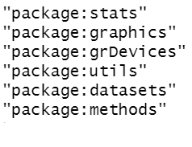
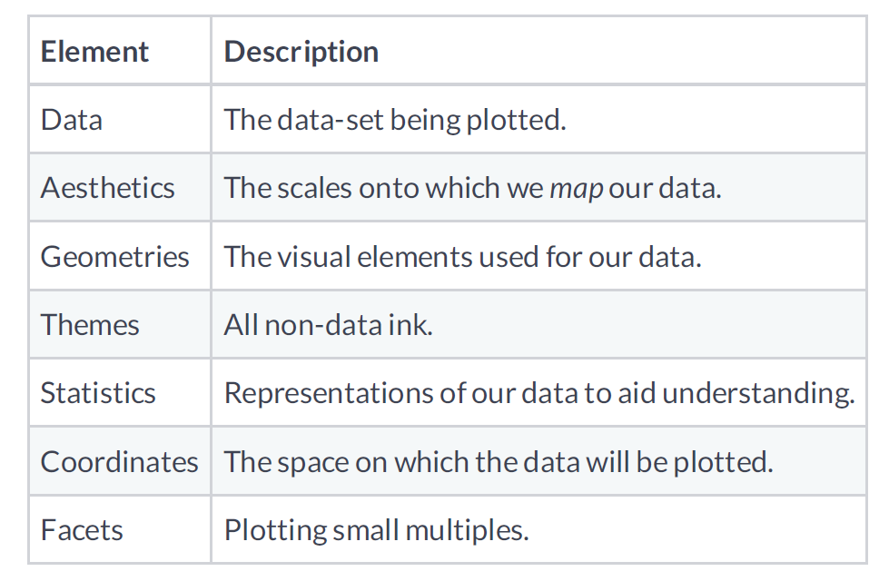
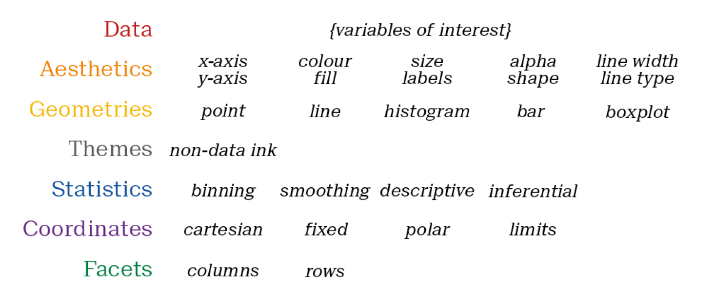
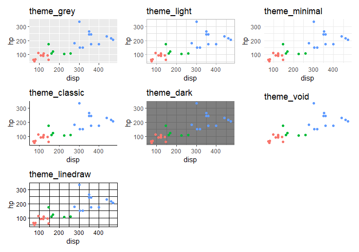

```{r setup, include=FALSE}
knitr::opts_chunk$set(echo = FALSE,
                      messsage = FALSE,
                      warning = FALSE,
                      fig.height = 5,
                      dpi = 60
                      )
```


## Recap of Part I

.pull-left[

- Setting up your work environment is essential for good project experience.

- Your interactions with R will be largely through functions which are contained in packages

- Most times, you will work with tabular data (made up of rows and columns)

]

.pull-right[

```{r, recap}
knitr::include_graphics("./imgs/recap.jpg")
```
]

---

## Part II outline

1. Importing your data (web, computer, other sources)

3. Managing different file formats (*.csv*, *.xlsx*, *.txt* etc)

4. Data cleaning and transformation

5. Basic analysis

6. Data visualization: plotting charts

---

## Our data at a glance (review)

.pull-left[

- ID: for patient/respondent identification

- Date: date of form completion 

- Age: current age of respondent/patient

- Sex: biological sex of respondent/patient at birth (Either male or female)

- State: One of 6 states (Rivers, FCT, Lagos, Sokoto, Abia and Kaduna)

]

.pull-right[

- Married: a dichotomous variable (YES/NO)

- Weight: weight of respondent/patient in "Kg"

- height: height of respondent/patient in "cm"

- blood pressue: systolic (numerator) and diastolic (denominator) blood pressure of respondent/patient

- bmi: values obtained from the field by dividing the weight (in Kg) by the square of the height (in metres)
]


---

## Organizing the project directory 

.pull-left[

- Put your data (inputs) in a different folder

- Keep your R scripts separate

- Keep your outputs in a different folders

- Keep your work reproducible, __*Avoid "point-and-click" as much as possible*__ 


]

.pull-right[
```{r, organize}

```
]

---


## Managing your R scripts

.pull-left[

- Will you be needing more than a single script?

- Divide your scripts into sections and label appropriately. Use **cTRL + SHIFT + R**

    - loading required packages
    
    - importing files
    
    - cleaning data
    
    - exploration
    
    - plotting charts
    
    - saving outputs
    
- Keep things simple

]

.pull-right[

```{r, think}

```

]

---


## Loading required packages 

.pull-left[

- **6 base** packages are loaded by default with their functions made available

- Generally, any other functions will require you to access the package first

- Consider all the additional packages you might need in addition to the base packages and load them

]

.pull-right[

```{r, base-pkgs}

```
]


---

## Importing your file

.pull-left[
- Is your file on the local computer or online?

- If online, do you want to import directly from the internet or download a local copy?

- What type of file extension are you working with? Different file extension may require different packages

- Import your file to R

- Format your file appropriately (print and variable names)

- Assign your file a name

- Is your file tidy? What are the challenges? 

]

.pull-right[
```{r, datascience}

```
]

---

## Data cleaning - {dplyr}, {tidyr} and other tidyverse packages

A few things identified with our data that we need to do

We need to:

.pull-left[

- Format column names

- Format the **date** for the Excel and the text documents

- Convert **sex** to factors (categorical variables)

- format **state** as factors

]

.pull-right[
- change **married** to a logical variable

- change **height** to metres

- split **BP** into **bp_systole** and **bp_diastole**

- Calculate new **BMI**
]

---

## Exploratory questions

1. How many persons from each state?

2. Plot a graph of the gender distribution

3. Plot a graph to demonstrate the relationship between weight and height

4. How many persons have systolic hypertension?

5. For each gender in each state, what are the average age, average height, and average weight?

---

class: inverse, middle, center
background-size: contain

# Plotting charts

---

## Data visualization

.pull-left[

- R has several packages for visualizing charts.

- Charts can be static, embedded with html widgets or interactive 

- {ggplot2} is one of the most common. Implemented based on the grammar of graphics

- The type of chart that you plot will depend on the type of data that you have

]


.pull-right[

```{r, grammar}

```

]

---

## Common plots

- Histogram: for continuous variables

- Bar chart: for categorical variables

- Scatter plots: for continous variables

- Line plot: for trend analysis

- Box plot: for visualization of summaries

- Pie chart: avoid if possible


---

## Layer options

.pull-left[

```{r, grammar-3}

```
]

.pull-right[

```{r, grammar-2}

```
]

---

## Themes

```{r, themes, out.height=500}

```

---

## Summary

- R can import several file types from both local or online platforms

- You will often need to clean and transform your data before analysis

- Analysis will depend on the type of conclusion of interest

- There are several powerful packages for visualization.

- {ggplot2}, one of the most common, uses graphical layers.

---

---
class: inverse, middle, center
background-image: url(https://upload.wikimedia.org/wikipedia/commons/3/39/Naruto_Shiki_Fujin.svg)
background-size: contain

# Questions


