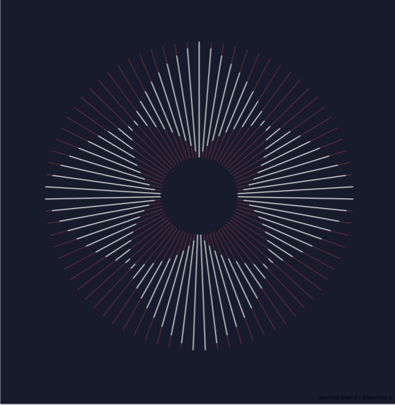

```{r setup, include=FALSE}
knitr::opts_chunk$set(echo = FALSE,
                      messsage = FALSE,
                      warning = FALSE,
                      fig.height = 5,
                      dpi = 60
                      )
```


## Outline

- About Abuja R user Group

- What can R do for you?

- Industries using R

- Other benefits of R

- What will you learn from this short course?

- Requirements / Installations

- Q&A (10 minutes)


---

## About me

.right-column[

- A Public Health Physician

- A quality improvement professional and patient safety expert - led me to data science

- I am currently the Team Lead, Epidemiology and Surveillance Unit for the CARITAS Nigeria 4GATES program

- Author, [{tidyndr}](https://CRAN.R-project.org/package=tidyndr)

- Co-founder: [r4hds](https://r4hds.netlify.app/)

- [My personal website](https://taiye.rbind.io) `r emoji::emoji("smile")`

- `r fontawesome::fa("twitter")`: follow @eppydoc `r emoji::emoji("thumbsup")`

- `r fontawesome::fa("linkedin")`: [Stephen Balogun](https://www.linkedin.com/in/stbalogun/) 
]

.left-column[
```{r, stephen}

```
]


---

## What can R do for you?

- You probably assume that R can be used for complex data analytics including visualization and modelling (I guess that's why you are here).

- Yes, `r fontawesome::fa(name = "r-project")` can do all of those, a lot more!!! `r emo::ji("love")` `r emo::ji("hug")`


- Let's take a look at some of the things R can do for you `r emo::ji("road")`


---

## Beautiful Arts in R

.pull-left[

```{r, ijeamaka-01, out.width="80%"}

```
<footnote> <i>source:</i> Ijeamaka Anyene |@ijeamaka_a
</footnote>

]

.pull-right[

```{r, ijeamaka-02, out.width="80%"}

```

]


---

## Beautiful Arts in R - 02

.pull-left[

```{r, ijeamaka-03, out.width="80%"}

```

<footnote> <i>source:</i> Ijeamaka Anyene |@ijeamaka_a
</footnote>

]

.pull-right[

```{r, ijeamaka-04, out.width="80%"}

```

]


---


## Games

.pull-left[

```{r, games-01, out.width="80%"}

```

<footnote>
  <i>source:</i>
  <a "https://rpodcast.shinyapps.io/hotshot_dashboard/?_ga=2.208167953.2086729808.1633251750-2118447652.1633251750">
  Hotshots dashboard engine
  </a>
</footnote>

]

.pull-right[

```{r, games-02, out.width="100%"}
knitr::include_graphics("./imgs/games_03.png")
```

]

---


## Text mining - 01

```{r, wordcloud-01, out.width="80%"}

```


<footnote>
  <i>source:</i>
  <a "https://www.r-graph-gallery.com/wordcloud.html">
  R graph gallery
  </a>
</footnote>

---

## Dashboards

.pull-left[

```{r, dashboard-01, out.width="100%"}

```

<footnote>
  <i>source:</i>
  <a "">
  Shiny demo
  </a>
</footnote>


]

.pull-right[

```{r, dashboard-02, out.width="100%"}
knitr::include_graphics("./imgs/dashboards_02.png")
```

<footnote>
  <i>source:</i>
  <a "https://skylab.cdph.ca.gov/ODdash/">
  California Overdose Surveillance
  </a>
</footnote>

]


---

## Websites

.pull-left[

```{r, website-01, out.width="100%"}
knitr::include_graphics("./imgs/website_01.png")
```

<footnote>
  <a "https://taiye.netlify.app">
  <i>Personal website</i>
  </a>
</footnote>

]

.pull-right[

```{r, website-02, out.width="100%"}
knitr::include_graphics("./imgs/website_02.png")

```


<footnote>
  <a "https://r4hds.app">
  <i>Corporate website</i>
  </a>
</footnote>
]


---

## Others

.pull-left[

- GIS Maps

```{r, gis, out.width="100%"}


```

<footnote>
  <i>Source</i>
  Balogun Stephen | @eppdoc
</footnote>

]

.pull-right[

- Music analysis ([rmusic]("https://towardsdatascience.com/compose-and-play-music-in-r-with-the-rmusic-package-b2afa90761ea") and [chorrrds]("https://www.analyticsvidhya.com/blog/2018/08/chorrrds-r-package-analyzing-working-music-data/"))

```{r music, out.width="85%"}

```
]

---

## R in Industries

.right-column[


```{r, industries, out.width="80%"}
knitr::include_graphics("./imgs/industries_02.png")
```


```{r, industries-02, out.width="80%"}

```

]

.left-column[

- Google

- Facebook

- Microsoft

- Twitter

- Norvatis

- WHO

- Bioconductor (genomics data analysis)

- Janssen


<footnote>
  <sup>1</sup><a "http://makemeanalyst.com/companies-using-r/">
  Companies using R
  </a>
  <br/>
  
  <sup>2</sup><a "https://r4hds.netlify.app/why_r">
  Why you should use R
  </a>
</footnote>
]

---

## Other benefits of R

- [Open source `r emo::ji("open")`](https://en.wikipedia.org/wiki/Open_source)

- [Free `r emo::ji("free")`](https://www.gnu.org/philosophy/free-sw.html)

- [Strong R community/support `r emo::ji("family")`](https://community.rstudio.com/)

- [Reproducible `r emo::ji("research")`](https://www.annualreviews.org/doi/10.1146/annurev-publhealth-012420-105110?url_ver=Z39.88-2003&rfr_id=ori%3Arid%3Acrossref.org&rfr_dat=cr_pub++0pubmed)

- Broad `r emo::ji("books")`
---

## What you will learn

This short course will get you started.

- Basic Introduction to R

- Importing your data into R

- Transforming your data into "easy-to-use" format

- Data visualization - making simple charts

- Communicating your findings

All these using practical examples!!!

`r emo::ji("cool")` right? `r emo::ji("wink")`

---

## Requirements

- [`r fontawesome::fa("r-project")` software](https://cran.r-project.org)

- [RStudio](https://www.rstudio.com/products/rstudio/download/)

- [some R packages](#installation-required-r-packages)

- A compiler (optional):

    - [Rtools on Windows](https://cran.r-project.org/bin/windows/Rtools/)
    
    - [Xcode command line tools on macOS](https://developer.apple.com/programs/register/)
    
- Good internet connection

---

## Installation - R

.left-column[

- Visit the [`CRAN` website](https://cran.r-project.org)

- Follow the instructions provided. 

- I encourage you accept default settings.
]

.right-column[
```{r, cran, out.width="100%"}
knitr::include_graphics("./imgs/cran.png")
```
]


---

## Installation - RStudio

.left-column[

- Visit the [RStudio website](https://www.rstudio.com/products/rstudio/download/)

- Scroll down a bit and download the free version. 

- Follow the installation prompt.
]

.right-column[
```{r, rstudio, out.width="100%"}
knitr::include_graphics("./imgs/rstudio.png")
```
]


---
## Installation - Required R packages

.pull-left[
- Download the [package demo folder](https://github.com/stephenbalogun/intro_to_R_demo/archive/refs/heads/master.zip)

- Unzip and place in a folder of your choice

- In the unzipped folder, click on `*.Rproj` file to open your project in `RStudio`

]

.pull-right[

```{r, installation-01, out.width="100%"}

```
]


---
## Installation - Required R packages 2

.left-column[
- Follow the three steps as indicated

- You will need internet connection

- Previously installed packages will *not* be re-installed

- You are now ready for the sessions!!!

]

.right-column[

```{r, installation-02, out.width="100%"}

```
]
  


---
class: inverse, middle, center
background-image: url(https://upload.wikimedia.org/wikipedia/commons/3/39/Naruto_Shiki_Fujin.svg)
background-size: contain

# Questions


